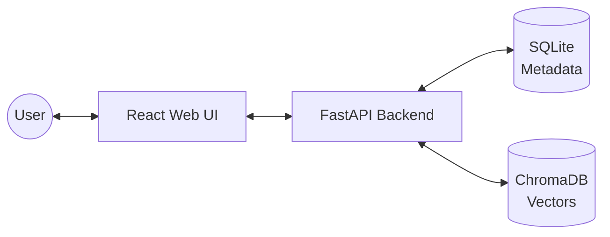
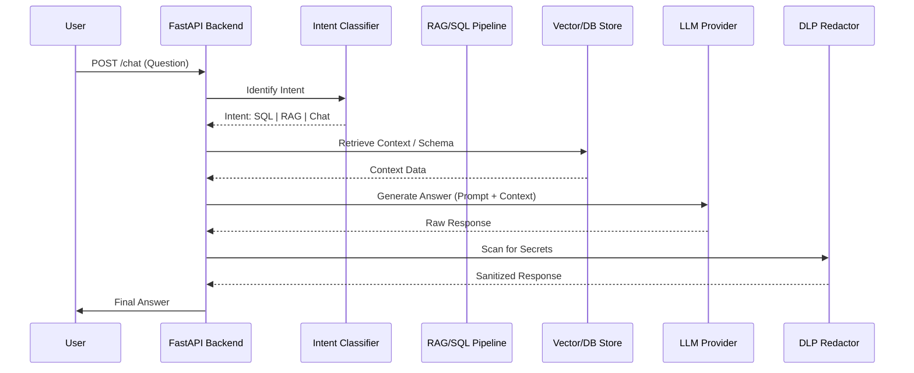

# QueryMind — Architecture Diagrams

This document provides visual representations of the QueryMind system architecture, request flows, and data processing pipelines.

---

## 1. Complete Project Architecture

A comprehensive view of all internal components, pipelines, storage layers, and external LLM integrations.

```mermaid
graph TD
    User([Admin / End User])

    subgraph Container ["QueryMind Docker Container"]
        subgraph Frontend ["React Admin UI"]
            UI_Pages[Chat / Ingest / Config]
            Axios[Axios API Client]
        end

        subgraph Backend ["FastAPI Backend"]
            Router_Chat[/chat]
            Router_Admin[/admin/*]
            
            Intent[Intent Classifier]
            
            subgraph Pipelines ["Pipelines"]
                SQL_RAG[SQL RAG Service]
                Doc_RAG[Document RAG Service]
                Redactor[DLP Redaction]
            end

            subgraph Services ["Core Services"]
                LLM_Factory[LLM Factory]
                Embed_Svc[Embedding Service]
                Encrypt_Svc[Encryption Service]
                Ingest_Svc[Ingest Service]
            end
        end

        subgraph Storage ["Persistent Storage"]
            SQLite[(SQLite DB\nMetadata & Sessions)]
            ChromaDB[(ChromaDB\nVector Store)]
            Uploads[Uploads Directory]
        end
    end

    subgraph External ["External Providers"]
        Ollama[Ollama\nLocal]
        OpenAI[OpenAI]
        Anthropic[Anthropic]
        Gemini[Google Gemini]
        Groq[Groq]
    end

    %% Interactions
    User -->|HTTPS| Frontend
    Frontend -->|Internal API| Backend
    Backend --> SQLite
    Backend --> ChromaDB
    Backend --> Uploads
    
    LLM_Factory --> External
    Embed_Svc --> Ollama
```

---

## 2. High-Level System Architecture

Simple interaction flow between the user and the main system components.



---

## 3. Chat Workflow (Sequence Diagram)

Detailed step-by-step from user query → intent classification → retrieval → LLM generation → response.



---

## 4. Document Ingestion Pipeline

Step-by-step flow of file upload → chunking → embedding → vector storage in ChromaDB.

```mermaid
graph TD
    Upload[File Uploaded] --> Save[Save to /uploads/]
    Save --> Parse[Extract Text\nPDF/DOCX/CSV]
    Parse --> Chunk[Chunking\nRecursive Character Split]
    Chunk --> Embed[Embedding Generation\nnomic-embed-text]
    Embed --> Store[Store in ChromaDB\n{tenant}_collection]
    Store --> Update[Update SQLite\nMetadata Table]
```
