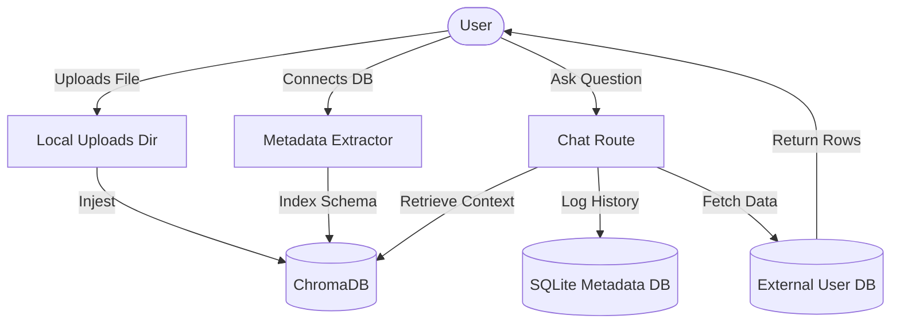

# QueryMind Data Architecture & Storage Documentation

This document provides a comprehensive overview of how data is stored, managed, and isolated within the QueryMind project.

## 1. Data Storage Strategy
QueryMind uses a **Hybrid Storage Architecture** combining three distinct storage types to balance performance, privacy, and intelligence:
1.  **Relational Database (SQL)**: For structured application state, user management, and configuration.
2.  **Vector Store (ChromaDB)**: For semantic search across documents and database schemas.
3.  **Local Filesystem**: For raw document storage and processing.

---

## 2. Detailed Data Mapping

| Data Category | Specific Data Points | Storage Engine | Location | Description |
| :--- | :--- | :--- | :--- | :--- |
| **Authentication** | Hashed passwords, Usernames, IDs | **SQLite** | `backend/querymind_metadata.db` | Stores credentials for the QueryMind admin dashboard. |
| **Configuration** | Encrypted DB URLs, LLM API Keys, Model Prefixes | **SQLite** | `backend/querymind_metadata.db` | System settings stored per tenant. Credentials are encrypted using Fernet. |
| **Chat History** | Session titles, prompt history, generated SQL, raw query results | **SQLite** | `backend/querymind_metadata.db` | Maintains a record of all conversations for context-aware follow-ups. |
| **Document Knowledge** | Chunked text vectors from PDFs, Docx, and TXT files | **ChromaDB** | `root/chroma_db/` | Used for the "Unstructured RAG" pipeline to answer general questions. |
| **SQL Metadata** | Table schemas, column types, AI-generated table descriptions | **ChromaDB** | `root/chroma_db/` | Used to help the LLM find the correct tables when generating SQL. |
| **Raw Assets** | Original PDF/Docx files | **Filesystem** | `backend/uploads/` | Stores the actual files uploaded by the user for processing/re-indexing. |
| **Transactional Data** | Sales, customers, logs, etc. | **External DB** | User's Remote Server | **QueryMind does not store your data.** It only "reads" it temporarily to display results. |

---

## 3. Storage Components in Detail

### 3.1. Application Metadata (SQLite)
The heartbeat of the application logic. It uses **SQLAlchemy** to manage:
- **`admin_users`**: User identifiers and authentication.
- **`admin_settings`**: A JSON-based configuration store for DB and LLM settings.
- **`chat_sessions`**: Grouping of messages into logical conversations.
- **`chat_messages`**: The individual logs of every interaction.

### 3.2. Vector Intelligence (ChromaDB)
This is where the "RAG" (Retrieval Augmented Generation) happens. Data is stored as high-dimensional vectors (embeddings):
- **Tenant Isolation**: Every user's data is isolated into collections prefixed with their `tenant_id` (e.g., `user_1_sql_metadata`).
- **Semantic Mapping**: When you ask "Who are my top customers?", QueryMind searches the `sql_metadata` collection to find tables related to "customers" or "users".

### 3.3. External Data (Target Databases)
QueryMind acts as a "Smart Proxy".
- **Connection**: It connects to your database (MySQL, PostgreSQL, or SQLite) using the `connection_url` you provide in Settings.
- **Privacy**: The actual rows of your database are **never** uploaded to a vector store or stored in the local SQLite file. They are fetched on-the-fly and sent to your browser.

---

## 4. Data Flow Diagram

---

## 5. Security & Persistence
- **Encryption**: Sensitive strings (API Keys, Database URLs) in the SQLite database are encrypted at rest.
- **Docker Volumes**: When running via Docker, both the `querymind_metadata.db` and the `chroma_db/` folder are mapped to persistent volumes to ensure data persists after container restarts.
